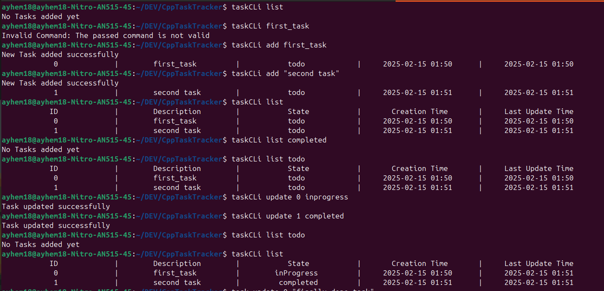
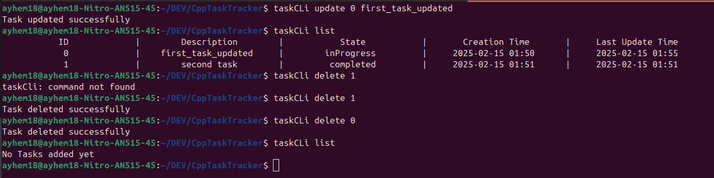
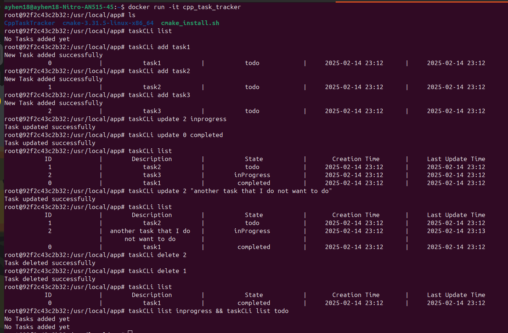
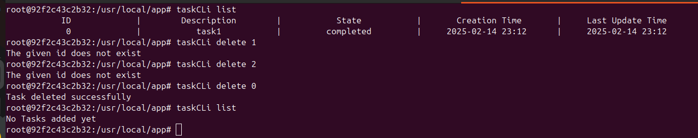

# Overview
This is my very first C++ project using a build system: a simple Command Line Interface to track tasks: basically a todo list application. The main goal of this project is to get 
more comfortable with the C++ language and the basics of build systems: CMake along with Docker and scripting. This project is part of roadmap.sh projects specifically [Project Url](https://roadmap.sh/projects/task-tracker). 


# Usage 
Regardless of the method, start by cloning the repository 

```
git clone https://github.com/yourusername/task-tracker.git
```

## Locally 

1. make sure the g++ compiler is installed
2. make sure CMake is installed
3. run the `build_script.sh` script to build the project 
4. either run `./src/taskCLi` or add `./src` repository to the $PATH variable and run `taskCLi` from anywhere in your system


## Docker 

1. build the docker image by calling `docker build -t cpp_task_tracker .`
2. run the docker container by calling `docker run -it cpp_task_tracker`

## Vscode
The `.vscode` directory contains a launch.json that can be used to debug and run the application in vscode.


# Project Structure

src/
├── headers
│   ├── app.h: the main object of the application
│   ├── taskManager.h: the manager of the tasks
│   └── task.h: the task object 
│   └── Display.h: for nice Command Line formatting
│   └── random_utils.h: functions to generate random numbers / strings 
│   └── string_utils.h: functions to works with strings
├── taskTracker
    basically the source files of the applications
├── tests
    simple files to test the application behavior: do not use a testing framework for now

└── build_script.sh
└── main.cpp: the application entry point


CMakeLists.txt
ReadMe.md


# Commands

## list
    taskCLi list : list all tasks
    taskCLi list [state] : list all tasks in the given state

## add
    taskCLi add [task_description] : adds a new task

## delete
    taskCLi delete [task_id] : deletes the task with the given id

## update
    taskCLi update [task_id] [new_task_state] : updates the task with the given id 
    taskCLi update [task_id] [new_task_description] : updates the task with the given id

    updating the task state is prioritized over updating the task description 

All data is persisted to a file called `data.txt` in the root directory of the project. 


# Examples

## Terminal




## Docker




